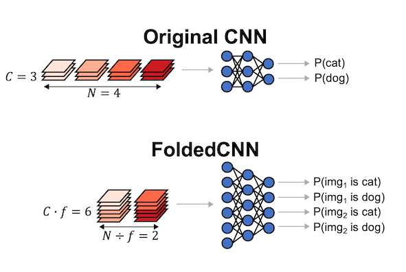

# FoldedCNNs

**Boosting the Throughput and Accelerator Utilization of Specialized CNN Inference Beyond Increasing Batch Size**

**ICML 2021**

**Abstract:**
Datacenter vision systems widely use small, specialized convolutional neural networks (CNNs) trained on specific tasks for high-throughput inference. These settings employ accelerators with massive computational capacity, but which specialized CNNs underutilize due to having low arithmetic intensity. This results in suboptimal application-level throughput and poor returns on accelerator investment. Increasing batch size is the only known way to increase both application-level throughput and accelerator utilization for inference, but yields diminishing returns; specialized CNNs poorly utilize accelerators even with large batch size. We propose FoldedCNNs, a new approach to CNN design that increases inference throughput and utilization beyond large batch size. FoldedCNNs rethink the structure of inputs and layers of specialized CNNs to boost arithmetic intensity: in FoldedCNNs, f images with C channels each are concatenated into a single input with fC channels and jointly classified by a wider CNN. Increased arithmetic intensity in FoldedCNNs increases the throughput and GPU utilization of specialized CNN inference by up to 2.5x and 2.8x, with accuracy close to the original CNN in most cases.

**Paper:** [PMLR link](http://proceedings.mlr.press/v139/kosaian21a.html)

**ICML 2021 schedule for the paper:** Spotlight presentation and Q&A in the "AutoML and Neural Network Architectures 1" session, on Tuesday 20th July 2021, 10 a.m. EDT — 11 a.m. EDT. Poster at Spot C2 in Virtual World, Tuesday 20th July 2021, 11 a.m. EDT — 2 p.m. EDT.

**Video:** [https://icml.cc/virtual/2021/spotlight/8416](https://icml.cc/virtual/2021/spotlight/8416) (Note: access to this link requires that one be registered for ICML 2021)

**Code:** [https://github.com/msr-fiddle/folded-cnns](https://github.com/msr-fiddle/folded-cnns)

Please raise any issues and pull requests within the linked repository.
